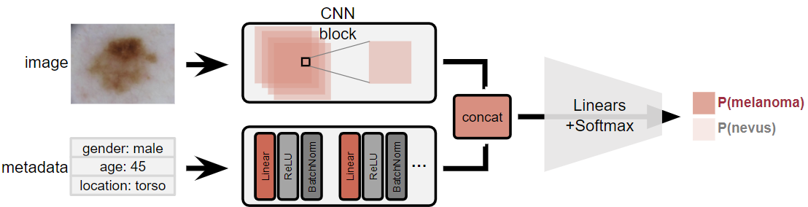

## Melanoma Diagnosis using CNN
------------------------------
## Project Tree
```
.
├── colab                     # runnable code in colab (run this)
│   ├── model.ipynb           # model code
│   ├── model_smote.ipynb     # smote model code 
│   └── score_calc.ipynb      # evaluating code
│
├── model                     # same with colab but seperated
│   ├── model.py              # model code
│   ├── smote.py              # apply smote code 
│   ├── score_calc.py         # evaluating code
│   └── training.py           # training code
│
├── img                       # img
│   └── model.PNG             # overall model picture
└── README.md
```

## Data
#### 1. Dataset
[ISIC 2020 challenge database](https://challenge2020.isic-archive.com/)

#### 2. Data representation
As will be explained below, we used efficient-net for feature extracting. Therefore, the image was resized to 240x240 so that it could be put into an efficient net.  
Meanwhile, the metadata used for learning were sex, age and site. This was expressed using **one hot encoding** and then concated and used as single tensor data.

## Model
The model consists of a CNN layer to learn images, an FC layer to learn meta data, and an FC layer to finally classify the results from each layer.

#### 1. CNN layer
We used **[efficient-net](https://github.com/lukemelas/EfficientNet-PyTorch)** as a baseline model. We use transfer learning so that this baseline model does feature extracting and we trained our models from these extracted features.

#### 2. FC layer (for metadata)
In FC layer, we use some regularization using Batch normalization, Dropout, etc. we use ReLU as activation function.

#### 3. FC layer (for classification)
Similar with FC layer for metadata and it finally classify to two classes (melanoma / nevus)

## Training
#### 1. Hyperparamter  
   **learning rate**: 0.0001  
   **learning rate decay**: 0.95  
   **weight decay**: 0.001  
   **learning rate scheduler**: StepLR (gamma = 0.95)  

#### 2. optimizer
   We used Adam as the optimizer. The Adam optimizer has the advantage of having a momentum and is able to learn faster and get out of the local minimum, and has the advantage of using an adaptive learning rate like RMSprop.


